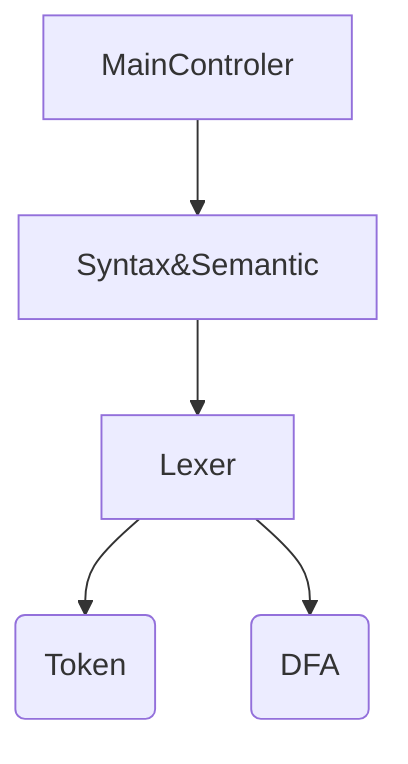

## 语法语义模块实现 ##
### 模块组织 ##
#### parser语法分析器
语法分析和语义分析都写在 `Parser.java` 这个文件中。其中，语法分析是由递归下降子程序法实现，而语义动作随着语法分析同步进行，所以语义分析的实现是写在语法分析程序的相应位置中。记法词法分析器是语法分析器的子程序，因此在语法分析中调用了词法分析的相应内容：
+ class Token; 表示记号的类，在语法分析中作为一个private的变量，存储由词法分析器读出来的字符。Token包含了token的基本信息，和记号在输入中的位置（在打印错误信息时用到）。
+ class Scanner; 用于扫描输入记号的类，是词法分析器的主控类。语法分析中调用了它的一系列方法，有：
  - Scanner.GetToken(); 读取一个记号并返回Token。
  - Scanner.InitScanner(String fileName); 初始化Scanner，让它从文件 `filename` 中开始读取记号。
  - Scanner.CloseScanner(); 关闭Scanner。
  - Scanner.DrawBuffre
  - Scanner.flag
  - Scanner.LineNo

#### MainGUI控制台 ####
程序的控制台写在 `Main.java` 这个文件中。它除了用 `window builder` 实现了GUI之外，就只调用了语法语义模块：
+ Parser.ParserAn("Programe.txt");

词法分析模块由语法语义分析模块调用。
调用了parser这个模块后，运行后，就已经完成了从指定文件中读取函数绘图语句，进行词法分析，由词法分析器创建分析过程中用到的 DFA 等工具，进行语法、语义分析等过程，最后给出图形的整个过程。
综上撰述，整个模块的组织形式是这样的：


### 语法语义分析 ###
语法分析和语义分析都写在 `Parser.java` 这个文件中。
#### 成员变量 ####
+ **public static List<double[]> list = new ArrayList<>()**  其中纪录了要绘图点的坐标，第一组 double[] 都是一对坐标值。
+ **private static Token token**  用于保存从词法分析器中读到的记号。
+ **private static double Parameter=0**  变量名，得到T的值。
+ **private static double Origin_x=0,Origin_y=0**  x，y初始值。
+ **private static double Scale_x=1,Scale_y=1**  压缩比例初始值为1:1。
+ **private static double Rot_angle**  旋转角度 。

#### 对外接口 ####
**public static void ParserAn(String FileName);**
对 `Main控制台` 的对外接口。它调用词法分析器 `Scanner`，指定要读取的文件名，如果文件不存在，则返回错误信息，之后调用 `FetchToken()`，`Program()`，`Scanner.CloseScanner()` 私有方法，启动语法、语义分析器，开始进行语法分析，并在完成后关闭词法分析器。

#### 私有方法 ####
**static void Program()** 
递归下降子程序之一，分析的是多条语句的集合，多条语句之间以 `;` 分隔。
在递归下降子程序中，它们的层级关系如下：
+ Program()
+ Statement()
+ OriginStatement()
+ RotSatement()
+ ScaleStatement()
+ ForStatement()
+ Expression()
+ Term()
+ Factor()
+ Component()
+ Atom()

在Program()一级中，当输入的 `Token` 的类型不是 `NONTOKE`，则调用 Statement()，并匹配一个分号。

---
**static void Statement()**
递归下降子程序之一，属于语句这一层级，语句之间以分号隔开。所以说分号之间的部分就属于 Statement 的范围。
它在执行时先判断当前 Token 的类型，有四种情况：
+ **ORIGIN**  跳转到 Origin 语句
+ **SCALE**  跳转到 Scale 语句
+ **RO**  跳转到 Rot 语句
+ **FO**  跳转到 For 语句

如果不是上面四种情况中的任何一种，就说明出现了不期望出现的 Token，则返回一个语法错误（没有期望的字符）

---
**static void OriginStatement()**
递归下降子程序之一，属于语句这一层级，具体的说是定位坐标轴语句，语句之间以分号隔开。以 记号 `Origin` 开头的语句是 OriginStatement。
它在执行时先匹配掉一个 `ORIGIN`，`IS`， `L_BRACKET`， 然后匹配一个 expression() 层级并将它的值存在 Origin_x 中，同理，将另一个 expression() 返回的值存在 Origin_y 中，最后匹配掉 `R_BRACKET`。

---
**static void RotSatement()**
递归下降子程序之一，属于语句这一层级，具体的说是旋转语句，语句之间以分号隔开。以 记号 `ROT` 开头的语句是 RotSatement。
它在执行时先匹配掉一个 `ROT`，`IS`，然后匹配一个 expression() 层级并将它的值存在 Rot_angle 中。

---
**static void ScaleStatement()**
递归下降子程序之一，属于语句这一层级，具体的说是缩放语句，语句之间以分号隔开。以 记号 `SCALE` 开头的语句是 ScaleSatement。
它在执行时先匹配掉一个 `Scale`，`IS`， `L_BRACKET`，然后匹配一个 expression() 层级并将它的值存在 Scale_x 中，同理，将另一个 expression() 返回的值存在 Scale_y 中，最后匹配掉 `R_BRACKET`。

---
**static void ForStatement()**
递归下降子程序之一，属于语句这一层级，具体的说是循环语句，语句之间以分号隔开。以 记号 `FOR` 开头的语句是 ForSatement。
它在执行时，按照匹配原则，取出循环的 start，end，step。然后通过上述变量作为参数调用 java 中的循环语句，在循环中加入语义动作，对每次循环，将得到的 x_ptr（第一个表达式） 和 y_ptr（第二个表达式）代入 CalcCoop() 方法中，计算绘图的坐标，并将它加入到 list 中（ list 是一个 double[] 类型的容器）。

---
**static double Expression()**
递归下降子程序之一，属于表达式这一层级。表达式是数字加符号组成的一个式子，它等于一个具体的值。
为了规定优先级，在设计语言文法时加入这些层级关系：

```
expression 	    : term   ( ( PLUS | MINUS ) term )*  ;
term       	    : factor ( ( MUL | DIV ) factor )* ;
factor  	      : ( PLUS | MINUS ) factor | component ;
component     	: atom ( POWER component )? ;
atom            : CONST_ID | T | FUNC L_BRACKET expression R_BRACKET 
                  | L_BRACKET expression R_BRACKET  ;
```

在方法执行时，先调用 Term() 返回一个左值，再通过判断符号类型来执行语义动作，如果类型是 `+`， `-`，则分别进行加减操作，若都不是，则返回左值。

---
**static double Term()**
递归下降子程序之一，属于Term这一层级。这一层处理二元的乘除运算。
表达式是数字加符号组成的一个式子，它等于一个具体的值。
在方法执行时，先调用 Factor() 返回一个左值，再通过判断符号类型来执行语义动作，如果类型是 `*`， `/`，则分别进行乘除操作，若都不是，则返回左值。
这里需要处理一个 **除数为0** 的异常。

---
**static double Factor()**
递归下降子程序之一，属于Factor这一层级。这一层处理一元的加减运算。
表达式是数字加符号组成的一个式子，它等于一个具体的值。
在方法执行时，根据前面的一元加减调用 Factor() 返回一个右值，若前面没有加减运算符，则调用 Component()，将它赋给右值，最后返回右值。

---
**static double Component()**
递归下降子程序之一，属于Component这一层级。这一层处理乘方运算。
表达式是数字加符号组成的一个式子，它等于一个具体的值。

---
**static double Atom()**
递归下降子程序之一，属于Atom这一层级。
表达式是数字加符号组成的一个式子，它等于一个具体的值。
这一层匹配的可以是：
+ CONST_ID
+ T
+ FUNC  （执行语义动作，调用 java 中的对应函数）
+ L_BRACKET （在括号中再匹配一个表达式）

default: SyntaxError

---
**static double[] CalcCoord(double Hor_Exp, double Ver_Exp)**
通过两个表达式参数，计算要绘图的坐标。


## 利用 ANTLR 工具生成词法、语法分析器 ##
除了用递归下降子程序法编写词法、语法分析器之外，我们还可以利用已有的工具来自动生成可用的词法、语法分析器的代码，其中有一个工具就是 **ANTLR**。
ANTLR 默认生成的是 java 代码。当然也可以用它来生成其它语言的代码。
利用 ANTLR 工具来生成词法、语法分析器，只需要在它指定的后缀为 `.g4` 的文件中写下你设计好的文法和规则。
我们设计的函数绘图语言的 `.g4` 文件如下：
```
// DFLC grammar
grammar program;

// parse
program         : ( statement SEMICO )*  ;
statement       : originStatment | scaleStatment | rotStatment | forStatment ;
originStatment  : 'ORIGIN' 'IS' L_BRACKET expression COMMA expression R_BRACKET ;
scaleStatment   : 'SCALE' 'IS' L_BRACKET expression COMMA expression R_BRACKET ;
rotStatment     : 'ROT' 'IS' expression ;
forStatment     : 'FOR' T 'FROM' CONST_ID 'TO' CONST_ID 'STEP' CONST_ID 'DRAW' L_BRACKET                  expression COMMA expression R_BRACKET;
expression 	    : term   ( ( PLUS | MINUS ) term )*  ;
term       	    : factor ( ( MUL | DIV ) factor )* ;
factor  	      : ( PLUS | MINUS ) factor | component ;
component     	: atom ( POWER component )? ;
atom            : CONST_ID | T | FUNC L_BRACKET expression R_BRACKET 
                  | L_BRACKET expression R_BRACKET  ;

// lex
LETTER	    : [a-zA-Z_] ;
DIGIT	      : [0-9] ;
ID          : LETTER+ (LETTER|DIGIT)* ;
CONST_ID    : DIGIT+ ('.' DIGIT*)? | 'PI' | 'E' ;
T           : ID ;
FUNC        : 'Sin' | 'Cos' | 'Tan' | 'Sqrt' | 'Exp' | 'Ln' ;
POWER       : '**' ;
COMMENT     : '//'|'--' ;
SEMICO      : ';' ;
L_BRACKET   : '(' ;
R_BRACKET   : ')' ;
COMMA       : ',' ;
PLUS        : '+' ;
MINUS       : '-' ;
MUL         : '*' ;
DIV         : '/' ;
WS          : [ \t\r\n]+ -> skip ; // skip spaces, tabs, newlines
```
